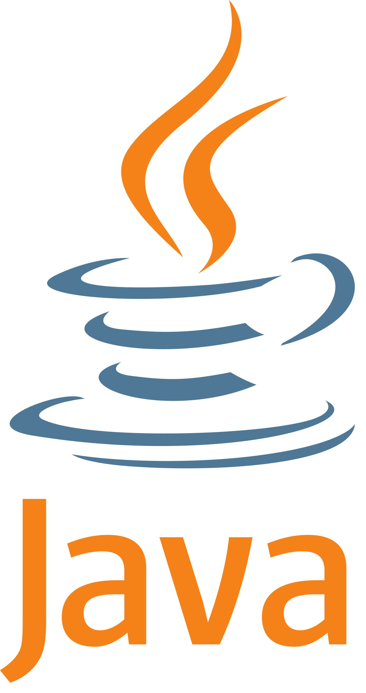

  

# Hello there!  

Currently an MSc student in Engineering Physics at <a href="https://tecnico.ulisboa.pt/pt/">Instituto Superior Técnico</a>. Check out some of the work in the repositories. :wink:

### My main programming language skills :desktop_computer: 
- C# 
- Python 
- SQL 
- HTML 

### Secondary language skills :desktop_computer:
- C++ 
- Java 
- CSS 

### Tools and Environments 🔧

</a>

### Interests 👨‍💻
- Physics;
- Engineering;
- IoT;
- Programming;
- Algorithms;
- Machine Learning;
- Deep Learning;
- Reinforcement Learning.

### Platforms 👨‍

<a href="https://www.linkedin.com/in/tiago-martins-9ba0a9154/">

  
# Stats 📈

<!--
**taamfp/taamfp** is a ✨ _special_ ✨ repository because its `README.md` (this file) appears on your GitHub profile. 
-->
